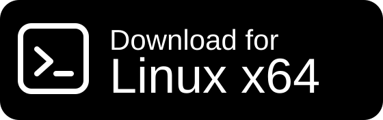
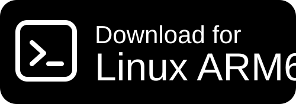
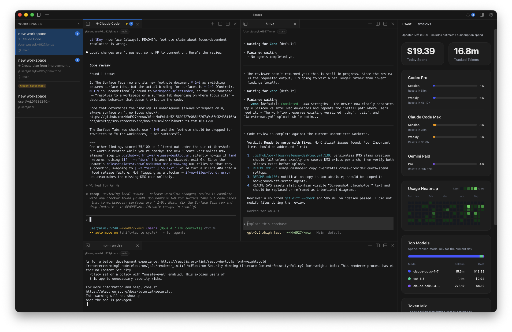
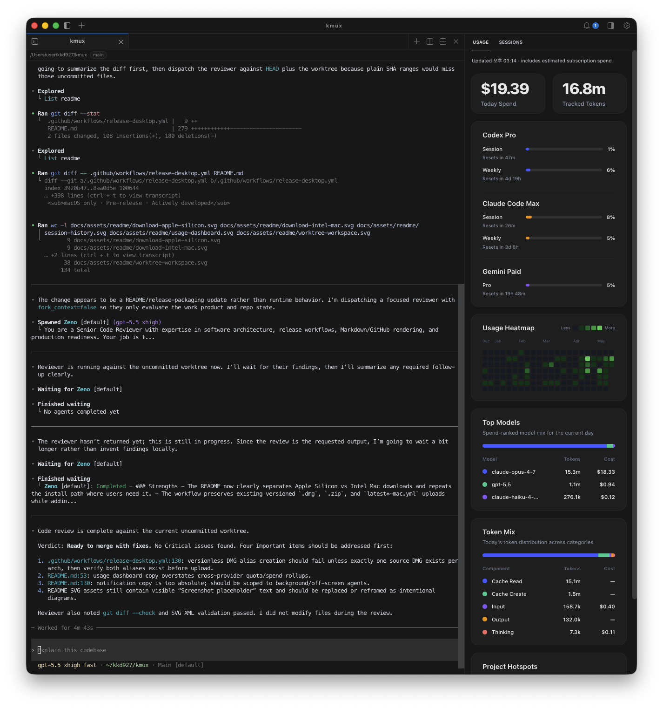
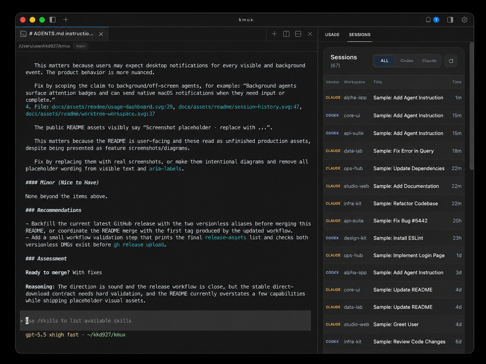
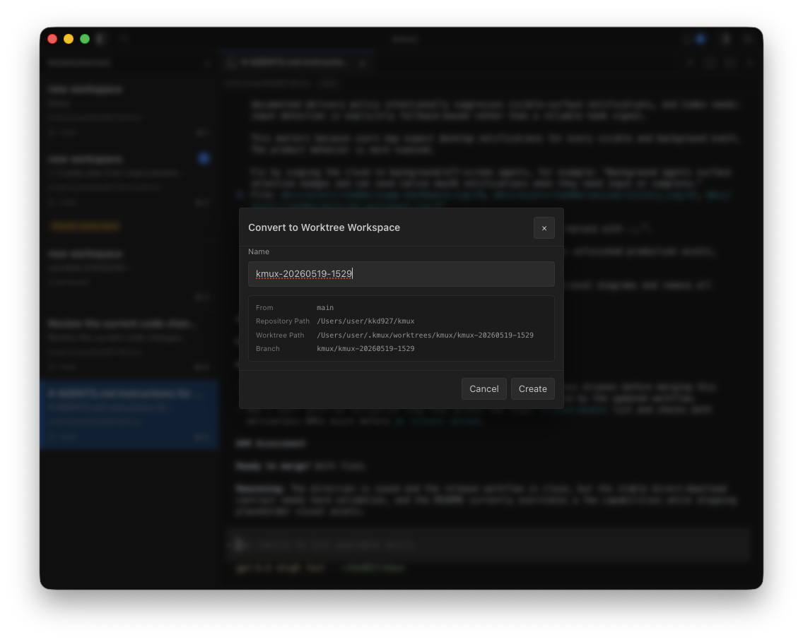
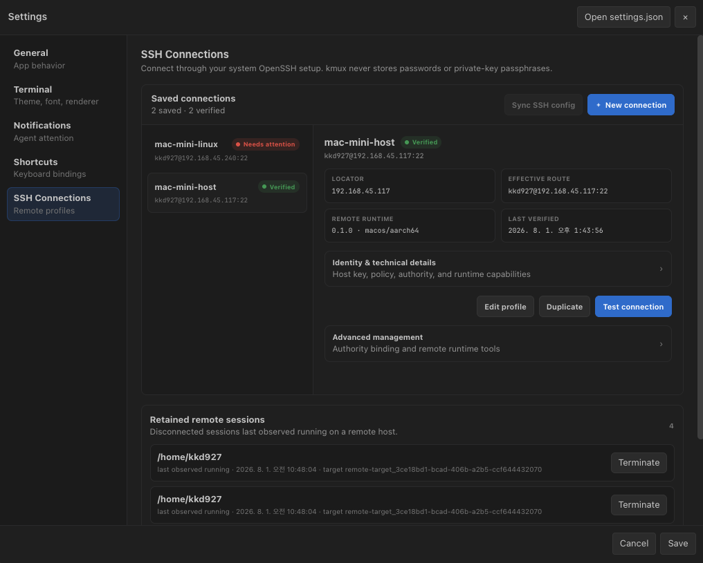

<div align="center">

# kmux

**El espacio de trabajo de terminal multi-sesión optimizado para ejecutar agentes de programación de IA en paralelo.**

Un emulador de terminal diseñado para Claude Code, Codex CLI y Antigravity CLI en macOS y Linux.<br>Realiza un seguimiento de las sesiones paralelas de tus agentes, monitorea el uso de la API y trabaja de manera segura en diferentes ramas mediante git worktrees nativos.

[](https://github.com/kkd927/kmux/actions/workflows/ci.yml)
[](https://github.com/kkd927/kmux/releases/latest)
[](./CONTRIBUTING.md)

<br>

<a href="README.md">English</a> | <a href="README.ja.md">日本語</a> | <a href="README.zh-CN.md">简体中文</a> | <a href="README.ko.md">한국어</a> | Español

<br>
<br>

<p>
  <strong>macOS</strong><br>
  <a href="https://github.com/kkd927/kmux/releases/latest/download/kmux-mac-arm64.dmg"></a>
  &nbsp;
  <a href="https://github.com/kkd927/kmux/releases/latest/download/kmux-mac-x64.dmg"></a>
</p>
<p>
  <strong>Linux</strong><br>
  <a href="https://github.com/kkd927/kmux/releases/latest/download/kmux-linux-x64.AppImage"></a>
  &nbsp;
  <a href="https://github.com/kkd927/kmux/releases/latest/download/kmux-linux-arm64.AppImage"></a>
</p>

<br>
<br>



</div>

<br>

## ¿Por qué kmux?
Ejecutar agentes de IA basados en CLI como **Claude Code**, **Codex CLI** o **Antigravity CLI** junto con tu servidor de desarrollo genera rápidamente desorden en la terminal, fragmenta el historial de sesiones y provoca conflictos de git cuando los agentes escriben en el mismo directorio de trabajo.

**kmux** soluciona esto proporcionando un espacio de trabajo de terminal dedicado y diseñado específicamente para flujos de trabajo con agentes:

- **Sesiones Paralelas Aisladas**: Ejecuta múltiples agentes simultáneamente en paneles divididos o pestañas verticales sin conflictos de entorno.
- **Notificaciones de Atención**: Recibe notificaciones nativas de escritorio y badges de espacio de trabajo de inmediato cuando un agente complete una tarea o requiera entrada humana.
- **Panel de Uso Unificado**: Monitorea el consumo de tokens y el gasto de API de todos tus proveedores de agentes en una sola barra lateral.
- **Reanudación Instantánea de Sesión**: Explora tu historial indexado y reanuda sesiones anteriores de tus agentes con un solo clic.
- **Espacios de Trabajo con Worktree**: Crea entornos de `git worktree` aislados automáticamente, permitiendo que múltiples agentes modifiquen de forma segura diferentes ramas del mismo repositorio.

<br>

## Características
<table>
<tr>
<td width="50%" valign="top">

### Panel de Uso Unificado
Monitorea el consumo de tokens y el gasto de API de Claude Code, Codex CLI y Antigravity CLI en un solo panel lateral — con mapa de calor diario, gasto de hoy, modelos más costosos y puntos de interés por proyecto.

</td>
<td width="50%" valign="top">



</td>
</tr>
<tr>
<td width="50%" valign="top">

### Historial de Sesiones entre Agentes
kmux indexa las sesiones de Claude, Codex y Antigravity en una sola barra lateral de búsqueda — haz clic en cualquier sesión para reanudarla al instante, en un panel nuevo o en la pestaña que ya esté abierta.

</td>
<td width="50%" valign="top">



</td>
</tr>
<tr>
<td width="50%" valign="top">

### Espacios de Trabajo con Worktree
Haz clic derecho en cualquier espacio de trabajo → **Convert to Worktree Workspace** para crear un `git worktree` aislado, así los agentes pueden editar distintas ramas del mismo repositorio en paralelo sin riesgo.

</td>
<td width="50%" valign="top">



</td>
</tr>
<tr>
<td width="50%" valign="top">

### Espacios de Trabajo SSH
Conecta cualquier host SSH como un espacio de trabajo de kmux con **Convert to SSH Workspace...** — divide terminales, ejecuta sesiones de agentes en paralelo y continúa donde lo dejaste al volver a abrir la app.

</td>
<td width="50%" valign="top">



</td>
</tr>
</table>

<br>

### Características de Terminal para Usuarios Avanzados
- **Paneles Divididos y Pestañas** — Agrupa servidores de desarrollo, logs y terminales de agentes dentro de un solo espacio de trabajo.
- **Barra Lateral Inteligente** — Detecta automáticamente tu directorio de trabajo activo (`cwd`), rama de git, puertos activos y notificaciones pendientes.
- **Persistencia de Distribución** — Restaura instantáneamente la distribución exacta de tus espacios de trabajo, pestañas activas y directorios al reiniciar la aplicación.
- **Búsqueda y Modo de Copia Vim** — Busca en el búfer de la terminal (`⌘ F`) y usa atajos al estilo Vim para seleccionar y copiar texto sin tocar el ratón.
- **Paleta de Comandos** — Accede a todas las acciones y comandos de espacios de trabajo personalizados rápidamente con `⌘ ⇧ P`.

<br>

## Instalación
### macOS

#### Homebrew (recomendado)

```bash
brew tap kkd927/kmux
brew install --cask kkd927/kmux/kmux
```

kmux incluye un actualizador integrado y te avisará cuando haya una nueva versión disponible.

#### Instalación mediante DMG

<p>
  <a href="https://github.com/kkd927/kmux/releases/latest/download/kmux-mac-arm64.dmg"></a>
  &nbsp;
  <a href="https://github.com/kkd927/kmux/releases/latest/download/kmux-mac-x64.dmg"></a>
</p>

1. Haz clic en el botón correspondiente a la arquitectura de tu Mac (procesadores M1/M2/M3/M4 de Apple Silicon → Apple Silicon, Macs más antiguos con Intel → Intel).
2. Abre el archivo `.dmg` descargado y arrastra **kmux** a tu carpeta de `Aplicaciones (Applications)`.
3. En el primer inicio, si macOS solicita confirmación de seguridad, haz clic en **Abrir** para continuar.

### Linux

<p>
  <a href="https://github.com/kkd927/kmux/releases/latest/download/kmux-linux-x64.AppImage"></a>
  &nbsp;
  <a href="https://github.com/kkd927/kmux/releases/latest/download/kmux-linux-arm64.AppImage"></a>
</p>

1. Elige la AppImage que coincida con tu CPU Linux (x64 → Intel/AMD 64-bit, ARM64 → ARM 64-bit).
2. Dale permisos de ejecución: `chmod +x kmux-linux-x64.AppImage` o `chmod +x kmux-linux-arm64.AppImage`
3. Ejecuta el archivo correspondiente: `./kmux-linux-x64.AppImage` o `./kmux-linux-arm64.AppImage`

<br>

## Inicio Rápido
1. Inicia kmux y crea tu primer espacio de trabajo (`⌘ N` en macOS).
2. Dentro de la terminal, ejecuta el CLI de tu agente local (`claude`, `codex` o `agy`).
   > 💡 **Nota**: kmux ejecuta los CLIs de los agentes que ya tienes instalados en tu sistema. No requiere que configures claves API ni wrappers adicionales en la aplicación.
3. Abre la barra lateral (`⌘ B` en macOS) para ver el panel de **Usage** y la lista de **Sessions**.
4. Crea otro espacio de trabajo para ejecutar otro agente de forma independiente, o haz clic derecho en un espacio de trabajo y selecciona **Convert to Worktree Workspace** si ambos van a interactuar con el mismo repositorio.
5. Cuando un agente requiera tu atención o termine su tarea, recibirás una notificación nativa de escritorio y se mostrará un indicador visual en el icono de su espacio de trabajo.

<br>

## Atajos de Teclado

> Los atajos siguientes muestran los valores predeterminados de macOS. Linux usa atajos de texto específicos de la plataforma, y todas las acciones también están disponibles desde la paleta de comandos.

### Espacios de Trabajo (Workspaces)

| Atajo     | Acción                        |
| :-------- | :---------------------------- |
| `⌘ N`     | Nuevo espacio de trabajo      |
| `⌘ ]`     | Siguiente espacio de trabajo  |
| `⌘ [`     | Anterior espacio de trabajo   |
| `⌘ 1`–`9` | Cambiar a espacio por número  |
| `⌘ ⇧ R`   | Renombrar espacio de trabajo  |
| `⌘ ⇧ W`   | Cerrar espacio de trabajo     |
| `⌘ B`     | Mostrar/Ocultar barra lateral |

### Paneles (Panes)

| Atajo                 | Acción                                 |
| :-------------------- | :------------------------------------- |
| `⌘ D`                 | Dividir verticalmente (a la derecha)   |
| `⌘ ⇧ D`               | Dividir horizontalmente (hacia abajo)  |
| `⌥ ⌘ ←` `→` `↑` `↓`   | Enfocar panel en la dirección indicada |
| `⌥ ⇧ ⌘ ←` `→` `↑` `↓` | Ajustar tamaño del panel               |
| `⌥ ⌘ K`               | Cerrar panel                           |

### Pestañas (Surface Tabs)

| Atajo     | Acción                       |
| :-------- | :--------------------------- |
| `⌘ T`     | Nueva pestaña de pantalla    |
| `⌃ Tab`   | Siguiente pestaña            |
| `⌃ ⇧ Tab` | Pestaña anterior             |
| `⌃ 1`–`9` | Cambiar a pestaña por número |
| `⌘ W`     | Cerrar pestaña               |
| `⌃ ⌘ W`   | Cerrar las demás pestañas    |

### Terminal y Utilidades (Terminal & Utilities)

| Atajo           | Acción                            |
| :-------------- | :-------------------------------- |
| `⌘ ⇧ P`         | Abrir paleta de comandos          |
| `⌘ F`           | Buscar en la terminal             |
| `⌘ G` / `⌘ ⇧ G` | Buscar siguiente / anterior       |
| `⌘ C` / `⌘ V`   | Copiar / Pegar                    |
| `⌘ ⇧ M`         | Modo de copia al estilo Vim       |
| `⌘ I`           | Activar/Desactivar notificaciones |
| `⌘ ⇧ U`         | Mostrar/Ocultar panel de uso      |
| `⌘ ,`           | Abrir preferencias                |

<br>

## Recursos y Documentación
|                           |                                                                                                        |
| :------------------------ | :----------------------------------------------------------------------------------------------------- |
| 📖 **Especificaciones**   | [docs/product-spec.md](./docs/product-spec.md) — Especificaciones completas, incluyendo Socket y CLI   |
| 🏗️ **Arquitectura ADR**   | [docs/adr/0002-electron-xterm-mvp-architecture.md](./docs/adr/0002-electron-xterm-mvp-architecture.md) |
| 🛠️ **Guía de Desarrollo** | [docs/development.md](./docs/development.md) — Compilación desde origen, ciclo de dev y depuración     |
| 🤝 **Contribuciones**     | [CONTRIBUTING.md](./CONTRIBUTING.md)                                                                   |
| 📜 **Código de Conducta** | [CODE_OF_CONDUCT.md](./CODE_OF_CONDUCT.md)                                                             |
| 🔒 **Política de Seg.**   | [SECURITY.md](./SECURITY.md)                                                                           |

<br>

<div align="center">

---

**kmux** — tus agentes de programación IA, ejecutándose codo a codo en paralelo.

<sub>macOS + Linux · En desarrollo activo</sub>

</div>
