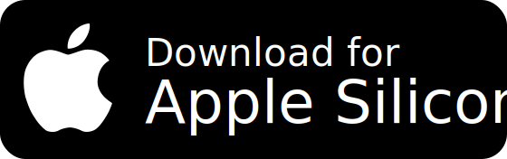
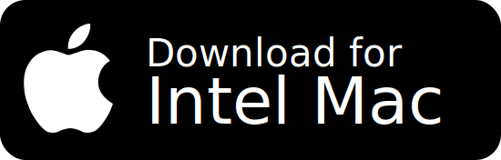
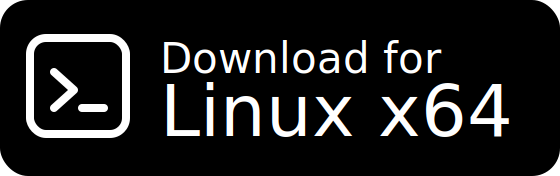
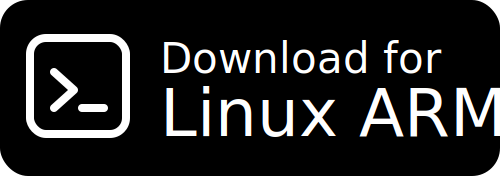
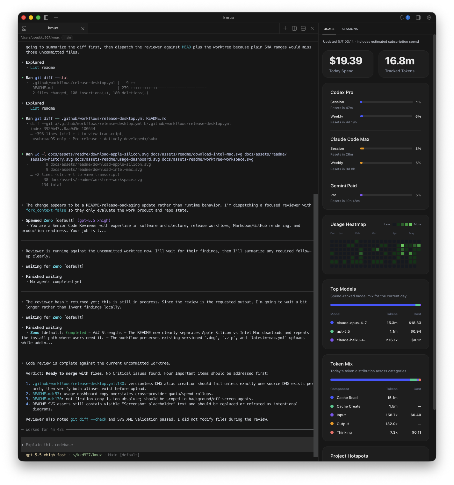
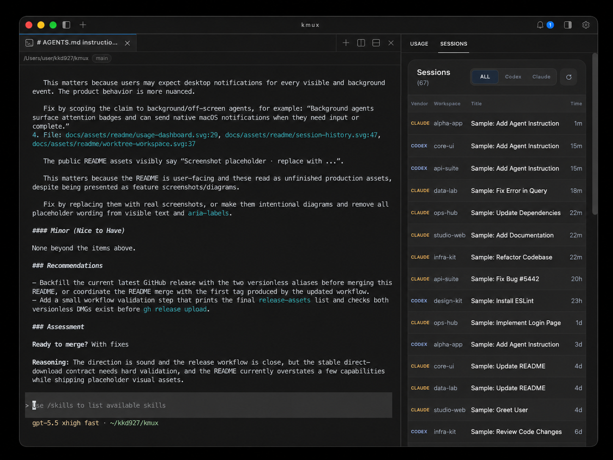
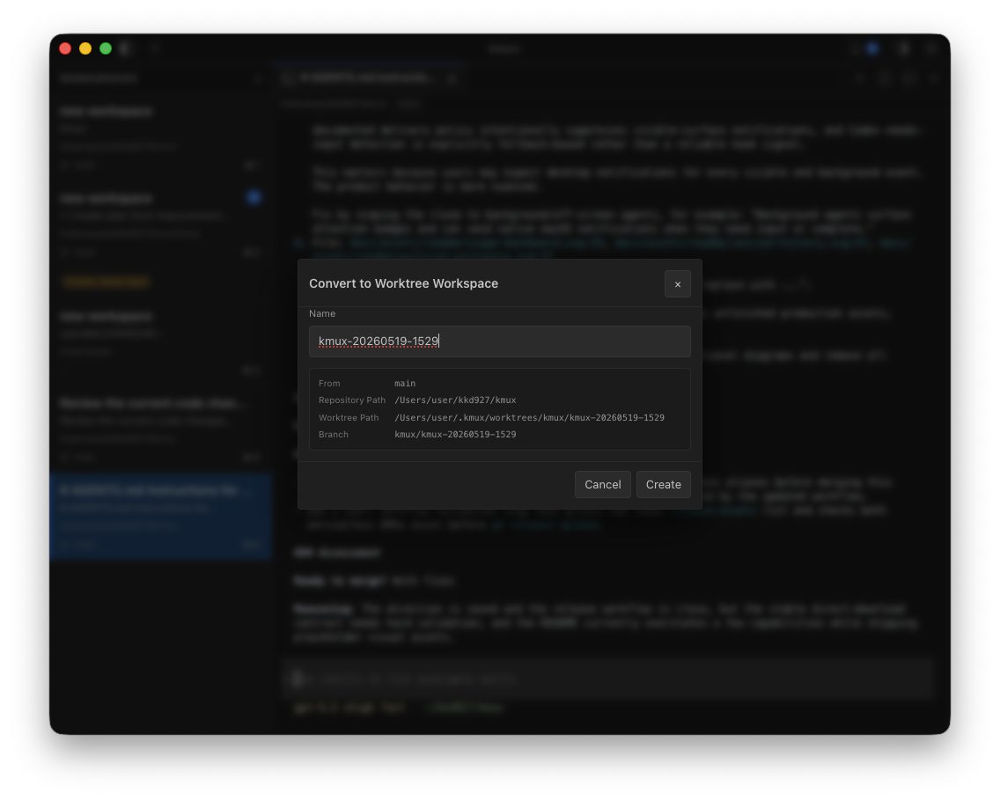

# kmux

**The multi-session terminal workspace for running AI coding agents side-by-side.**

A keyboard-centric terminal emulator designed for Claude Code, Codex CLI, Gemini CLI, and Antigravity CLI on macOS and Linux. Keep track of parallel agent sessions, monitor API usage, and work safely on separate branches via native git worktrees.

 

English | <a href="README.ja.md">日本語</a> | <a href="README.zh-CN.md">简体中文</a> | <a href="README.ko.md">한국어</a> | <a href="README.es.md">Español</a>

 
 

  <strong>macOS</strong> 
  
  &nbsp;
  

  <strong>Linux</strong> 
  
  &nbsp;
  

 
 

 

## ✨ Why kmux?

Running CLI-based AI agents like **Claude Code** or **Gemini CLI** alongside your development server quickly leads to terminal clutter, fragmented session history, and git conflicts when agents write to the same working directory.

**kmux** solves this by providing a dedicated terminal workspace built for agent workflows:

- **Isolated Parallel Sessions**: Run multiple agents simultaneously in split panes or vertical tabs without environment conflicts.
- **Attention Notifications**: Get native desktop notifications and workspace badges immediately when an agent completes a task or requires human input.
- **Unified Usage Dashboard**: Monitor API spend, token heatmaps, and session budgets across all agent providers in a single sidebar.
- **Instant Session Resume**: Browse your indexing history and resume past agent sessions in one click.
- **Worktree Workspaces**: Spin up isolated `git worktree` environments automatically, allowing multiple agents to safely modify different branches of the same repository.

 

## 🚀 Highlights

<table>
<tr>
<td width="50%" valign="top">

### 📊 Unified Usage Dashboard

Monitor your token consumption and API spend across Claude Code, Codex CLI, Gemini CLI, and Antigravity CLI in one right-sidebar panel. kmux aggregates usage data directly from local session logs, replacing provider-specific command line history with a single live visual dashboard.

Features a daily heatmap, today's spend, top-spending models, and per-project hotspots.

</td>
<td width="50%" valign="top">

</td>
</tr>
<tr>
<td width="50%" valign="top">

</td>
<td width="50%" valign="top">

### 🕘 Cross-Agent Session History

kmux automatically indexes the local session databases for all four agents — Claude (`~/.claude/projects`), Codex (`~/.codex/sessions`), Gemini (`~/.gemini/tmp`), and Antigravity (`~/.gemini/antigravity-cli`) — presenting them in one searchable sidebar.

Clicking a session resumes it instantly. kmux will focus the existing workspace/tab for that directory if open, or automatically spin up a fresh pane and run the resume commands (`claude --resume`, `codex resume`, etc.) for you.

</td>
</tr>
<tr>
<td width="50%" valign="top">

### 🌳 Worktree Workspaces

Right-click any workspace → **Convert to Worktree Workspace** to spin up an isolated `git worktree`. This allows multiple agents to safely edit different branches of the same repository simultaneously without messing up your main working tree.

kmux tracks the entire worktree lifecycle (branch status, modifications, and deletion safety checks) so your work is never lost or orphaned.

</td>
<td width="50%" valign="top">

</td>
</tr>
</table>

 

### 🛠️ Terminal Power-User Features

- **Split Panes & Tabs** — Group build servers, logs, and agent shells within a single workspace.
- **Smart Sidebar** — Automatically detects your active working directory (`cwd`), git branch, listening ports, and unread status.
- **Layout Persistence** — Instantly restores your exact workspace layouts, active tabs, and directories when you relaunch the app.
- **Vim Copy Mode & Search** — Search terminal buffers (`⌘ F`) and use Vim-like keybindings to select and copy text without touching the mouse.
- **Command Palette** — Access all actions and custom workspace commands quickly with `⌘ ⇧ P`.

 

## 📦 Install

  <strong>macOS</strong> 
  
  &nbsp;
  

  <strong>Linux</strong> 
  
  &nbsp;
  

### macOS

1. Click the button that matches your Mac (M1/M2/M3/M4 → Apple Silicon, older Intel Macs → Intel)
2. Open the downloaded `.dmg` and drag **kmux** into your `Applications` folder
3. On first launch, macOS may ask you to confirm — click **Open**

### Linux

1. Choose the AppImage for your Linux CPU (x64 → Intel/AMD 64-bit, ARM64 → ARM 64-bit)
2. Make it executable: `chmod +x kmux-linux-x64.AppImage` or `chmod +x kmux-linux-arm64.AppImage`
3. Run the matching file: `./kmux-linux-x64.AppImage` or `./kmux-linux-arm64.AppImage`

 

## 🏁 Quick Start

1. Launch kmux and create a workspace (`⌘ N` on macOS).
2. Inside the terminal, run your local agent CLI — `claude`, `codex`, `gemini`, or `agy`.
   > 💡 **Note**: kmux runs the agent CLIs already installed on your system. It does not require you to configure any API keys or wrappers.
3. Toggle the sidebar (`⌘ B` on macOS) to see the **Usage** and **Sessions** panels.
4. Create another workspace to run another agent — or right-click a workspace → **Convert to Worktree Workspace** if both need to touch the same repo.
5. When an agent needs input or finishes, a native desktop notification fires and the workspace picks up an attention badge.

 

## ⌨️ Keyboard Shortcuts

> Shortcuts below show the macOS defaults. Linux uses platform-specific text shortcuts, and every action is also reachable from the command palette.

### Workspaces

| Shortcut  | Action                        |
| :-------- | :---------------------------- |
| `⌘ N`     | New workspace                 |
| `⌘ ]`     | Next workspace                |
| `⌘ [`     | Previous workspace            |
| `⌘ 1`–`9` | Switch to workspace by number |
| `⌘ ⇧ R`   | Rename workspace              |
| `⌘ ⇧ W`   | Close workspace               |
| `⌘ B`     | Toggle sidebar                |

### Panes

| Shortcut              | Action                   |
| :-------------------- | :----------------------- |
| `⌘ D`                 | Split right (vertical)   |
| `⌘ ⇧ D`               | Split down (horizontal)  |
| `⌥ ⌘ ←` `→` `↑` `↓`   | Focus pane directionally |
| `⌥ ⇧ ⌘ ←` `→` `↑` `↓` | Resize pane              |
| `⌥ ⌘ K`               | Close pane               |

### Surface Tabs

| Shortcut  | Action                      |
| :-------- | :-------------------------- |
| `⌘ T`     | New surface tab             |
| `⌃ Tab`   | Next surface                |
| `⌃ ⇧ Tab` | Previous surface            |
| `⌃ 1`–`9` | Switch to surface by number |
| `⌘ W`     | Close surface               |
| `⌃ ⌘ W`   | Close other surfaces        |

### Terminal & Utilities

| Shortcut        | Action                 |
| :-------------- | :--------------------- |
| `⌘ ⇧ P`         | Command palette        |
| `⌘ F`           | Search in terminal     |
| `⌘ G` / `⌘ ⇧ G` | Find next / previous   |
| `⌘ C` / `⌘ V`   | Copy / paste           |
| `⌘ ⇧ M`         | Vim-style copy mode    |
| `⌘ I`           | Toggle notifications   |
| `⌘ ⇧ U`         | Toggle usage dashboard |
| `⌘ ,`           | Open settings          |

 

## 📚 Resources

|                          |                                                                                                        |
| :----------------------- | :----------------------------------------------------------------------------------------------------- |
| 📖 **Product Spec**      | [docs/product-spec.md](./docs/product-spec.md) — full feature spec, including automation socket & CLI  |
| 🏗️ **Architecture ADR**  | [docs/adr/0002-electron-xterm-mvp-architecture.md](./docs/adr/0002-electron-xterm-mvp-architecture.md) |
| 🛠️ **Development Guide** | [docs/development.md](./docs/development.md) — build from source, dev loop, debugging                  |
| 🤝 **Contributing**      | [CONTRIBUTING.md](./CONTRIBUTING.md)                                                                   |
| 📜 **Code of Conduct**   | [CODE_OF_CONDUCT.md](./CODE_OF_CONDUCT.md)                                                             |
| 🔒 **Security Policy**   | [SECURITY.md](./SECURITY.md)                                                                           |

 

---

**kmux** — your AI coding agents, side-by-side.

macOS + Linux · Pre-release · Actively developed

