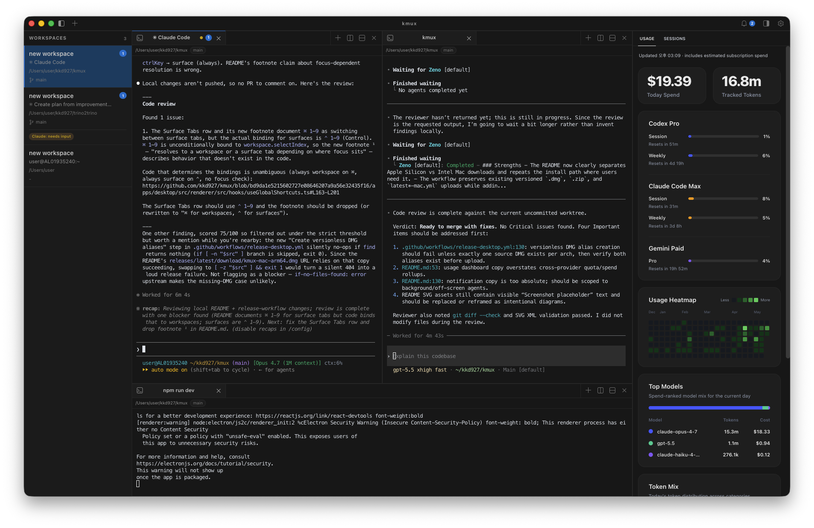

<div align="center">

# kmux

**A keyboard-first terminal workspace manager for macOS**

Split panes. Tabbed surfaces. Sidebar status. Automation-ready.

[](https://github.com/kkd927/kmux/actions/workflows/ci.yml)
[](https://github.com/kkd927/kmux/releases/latest)
[](https://github.com/kkd927/kmux/releases/latest)
[](https://www.electronjs.org/)
[](https://nodejs.org/)
[](https://www.typescriptlang.org/)
[](./CONTRIBUTING.md)

[**Download**](https://github.com/kkd927/kmux/releases/latest) · [**Getting Started**](#-getting-started) · [**Shortcuts**](#-keyboard-shortcuts) · [**Docs**](./docs/product-spec.md) · [**Contributing**](./CONTRIBUTING.md)

<br>



</div>

<br>

## ✨ Why kmux?

**kmux** reimagines your terminal as a full workspace manager — not just a tabbed shell. Organize sessions into named workspaces, split panes freely, keep multiple surface tabs per pane, and let the smart sidebar track your context automatically.

<table>
<tr>
<td width="50%">

### 🖥️ Split Panes & Surface Tabs

Split your terminal horizontally or vertically with a single keystroke. Each pane can hold multiple **surface tabs**, so you can group related sessions (server, logs, tests) right next to each other without clutter.

</td>
<td width="50%">

### 📂 Multi-Workspace

Create dedicated workspaces per project. Each workspace remembers its own layout, splits, and surfaces. Switch instantly with `⌘ ]` / `⌘ [` or jump by number.

</td>
</tr>
<tr>
<td width="50%">

### 📡 Sidebar & Notifications

The smart sidebar shows each workspace's **cwd**, **git branch**, **active ports**, and an **unread badge** — all at a glance. Notifications, status pills, progress bars, and log feeds live here too.

</td>
<td width="50%">

### 🤖 Automation & CLI

Drive everything programmatically via the built-in **CLI** and **Unix socket API**. Create workspaces, send keystrokes, set sidebar status, and trigger notifications — perfect for scripting and AI coding agents.

</td>
</tr>
</table>

<br>

## 🏗️ Feature Highlights

| Feature               | Description                                                         |
| :-------------------- | :------------------------------------------------------------------ |
| **Workspaces**        | Named, persistent workspaces with full layout restore on launch     |
| **Split Panes**       | Horizontal and vertical splits with directional keyboard navigation |
| **Surface Tabs**      | Multiple tabs per pane — group related shells together              |
| **Smart Sidebar**     | Auto-detected cwd, git branch, port info, unread badges             |
| **Notifications**     | In-app notification center with attention indicators                |
| **Command Palette**   | Quick-access command palette (`⌘ ⇧ P`)                              |
| **Terminal Search**   | Find in terminal with `⌘ F`, navigate matches with `⌘ G`            |
| **Copy Mode**         | Vim-style copy mode for keyboard-only text selection                |
| **Session Restore**   | Full workspace + layout persistence across restarts                 |
| **Automation Socket** | JSON-RPC over Unix domain socket for external scripting             |
| **CLI**               | `kmux` CLI to manage workspaces, surfaces, and notifications        |
| **macOS Native**      | Proper title bar integration, native look and feel                  |

<br>

## 📦 Installation

### DMG Download (Recommended)

> **Apple Silicon** (M1/M2/M3/M4) → download the `arm64` build  
> **Intel Mac** → download the `x64` build

1. Download the latest `.dmg` from the [**Releases**](https://github.com/kkd927/kmux/releases/latest) page
2. Open the `.dmg` and drag **kmux** into your `Applications` folder
3. On first launch, macOS may ask you to confirm — click **Open**

### Build from Source

```bash
# Clone
git clone https://github.com/kkd927/kmux.git
cd kmux

# Install dependencies
npm install

# Launch in development mode
npm run dev

# Or build the production .dmg
npm run package:mac
```

**Requirements:** Node.js 22+, npm 10+, macOS 13+

<br>

## 🚀 Getting Started

1. **Launch kmux** — open the app or run `npm run dev`
2. **Create a workspace** — press `⌘ N`
3. **Split a pane** — `⌘ D` (vertical) or `⌘ ⇧ D` (horizontal)
4. **Add a surface tab** — `⌘ T` inside any pane
5. **Toggle sidebar** — `⌘ B` to see workspace context and status
6. **Search terminal** — `⌘ F` to find text in scrollback

<br>

## ⌨️ Keyboard Shortcuts

### Workspaces

| Shortcut  | Action                        |
| :-------- | :---------------------------- |
| `⌘ N`     | New workspace                 |
| `⌘ ]`     | Next workspace                |
| `⌘ [`     | Previous workspace            |
| `⌘ 1`–`9` | Switch to workspace by number |
| `⌘ ⇧ R`   | Rename workspace              |
| `⌘ ⇧ W`   | Close workspace               |
| `⌘ B`     | Toggle sidebar                |

### Panes

| Shortcut              | Action                   |
| :-------------------- | :----------------------- |
| `⌘ D`                 | Split right (vertical)   |
| `⌘ ⇧ D`               | Split down (horizontal)  |
| `⌥ ⌘ ←` `→` `↑` `↓`   | Focus pane directionally |
| `⌥ ⇧ ⌘ ←` `→` `↑` `↓` | Resize pane              |
| `⌥ ⌘ K`               | Close pane               |

### Surface Tabs

| Shortcut  | Action                      |
| :-------- | :-------------------------- |
| `⌘ T`     | New surface tab             |
| `⌃ Tab`   | Next surface                |
| `⌃ ⇧ Tab` | Previous surface            |
| `⌘ 1`–`9` | Switch to surface by number |
| `⌘ W`     | Close surface               |
| `⌃ ⌘ W`   | Close other surfaces        |

### Terminal & Utilities

| Shortcut        | Action               |
| :-------------- | :------------------- |
| `⌘ ⇧ P`         | Command palette      |
| `⌘ F`           | Search terminal      |
| `⌘ G` / `⌘ ⇧ G` | Find next / previous |
| `⌘ C`           | Copy                 |
| `⌘ V`           | Paste                |
| `⌘ ⇧ M`         | Copy mode            |
| `⌘ I`           | Toggle notifications |
| `⌘ ,`           | Toggle settings      |

<br>

## 🤖 Automation & CLI

kmux exposes a **JSON-RPC API** over Unix domain socket and a companion **CLI** for scriptable workflows.

```bash
# Build the CLI
npm run build

# System
kmux system ping
kmux system capabilities

# Workspaces
kmux workspace list
kmux workspace create --name "my-project"
kmux workspace select --id <workspace-id>
kmux workspace current

# Surfaces
kmux surface split --direction right
kmux surface send-text --text "npm run dev\n"
kmux surface send-key --key Enter

# Notifications
kmux notification create --title "Build complete" --body "All tests passed"

# Sidebar
kmux sidebar set-status --text "deploying..." --style warning
kmux sidebar set-progress --value 75
kmux sidebar log --message "Step 3/5 complete"
```

### Socket API

Connect directly to the Unix domain socket for programmatic control:

```
KMUX_SOCKET_PATH=/tmp/kmux-<uid>.sock
```

The socket accepts JSON-RPC 2.0 messages. See the full API surface in the [product spec](./docs/product-spec.md).

<br>

## 🏛️ Architecture

```
apps/
  desktop/
    src/main/        # Electron main — state, persistence, socket API
    src/preload/     # Typed IPC bridge
    src/pty-host/    # node-pty + headless terminal runtime
    src/renderer/    # xterm.js UI, split layout, sidebar
packages/
  core/              # Domain state, reducers, layout transforms
  proto/             # IPC and socket contracts
  persistence/       # File-store persistence helpers and app paths
  metadata/          # Git, ports, cwd detection
  cli/               # kmux automation CLI
  ui/                # Shared UI tokens and helpers
```

**Key design decisions:**

- The **renderer never owns PTY sessions** — all terminal lifetime is managed by `pty-host`
- **Visible-only rendering** — hidden surfaces don't keep DOM terminals mounted
- **Single-writer state** — all mutations flow through the main-process reducer
- **Attach + snapshot** — switching surfaces re-attaches with full scrollback, no re-creation

For the full architecture rationale, see the [ADR](./docs/adr/0002-electron-xterm-mvp-architecture.md).

<br>

## 🙋 Contributing

Contributions are welcome! Please read the [Contributing Guide](./CONTRIBUTING.md) before opening a PR.

```bash
# Development workflow
npm install          # Install deps
npm run dev          # Launch dev mode
npm run test         # Run unit tests
npm run lint         # Lint
npm run build        # Full production build
npm run test:e2e     # End-to-end tests
```

See [docs/development.md](./docs/development.md) for the full developer guide.

<br>

## 📚 Resources

|                          |                                                                                                        |
| :----------------------- | :----------------------------------------------------------------------------------------------------- |
| 📖 **Product Spec**      | [docs/product-spec.md](./docs/product-spec.md)                                                         |
| 🏗️ **Architecture ADR**  | [docs/adr/0002-electron-xterm-mvp-architecture.md](./docs/adr/0002-electron-xterm-mvp-architecture.md) |
| 🛠️ **Development Guide** | [docs/development.md](./docs/development.md)                                                           |
| 🤝 **Contributing**      | [CONTRIBUTING.md](./CONTRIBUTING.md)                                                                   |
| 📜 **Code of Conduct**   | [CODE_OF_CONDUCT.md](./CODE_OF_CONDUCT.md)                                                             |
| 🔒 **Security Policy**   | [SECURITY.md](./SECURITY.md)                                                                           |

<br>

<div align="center">

---

**kmux** is built with ❤️ using Electron, xterm.js, and node-pty.

<sub>macOS only · Pre-release · Actively developed</sub>

</div>
