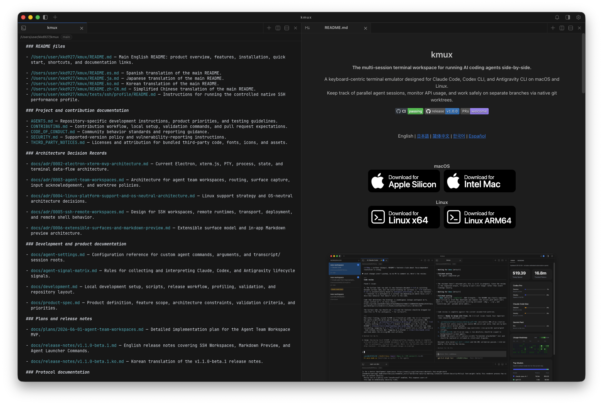

| 주요 기능                                           | 내용                                                                             |
| --------------------------------------------------- | -------------------------------------------------------------------------------- |
| [SSH Workspaces](#ssh-workspaces)                   | 원격 호스트를 kmux 워크스페이스로 연결해 로컬 워크스페이스와 함께 사용합니다.     |
| [Markdown Preview](#markdown-preview)               | 터미널의 Markdown 경로를 클릭해 작업 중인 에이전트 옆에서 문서를 확인합니다.      |
| [Agent Launcher Commands](#agent-launcher-commands) | 에이전트 세션을 재개할 명령어를 로컬과 SSH 환경별로 지정합니다.                   |

---

## SSH Workspaces

이제 SSH 호스트를 kmux 워크스페이스로 직접 연결할 수 있습니다. 터미널을
나누고, 여러 에이전트 세션을 나란히 실행하고, 앱을 다시 열어 하던 작업을
이어갈 수 있습니다.


### 시작하기

1. 왼쪽 사이드바에서 워크스페이스를 생성한 뒤, Command Palette 또는
   워크스페이스 메뉴에서 **Convert to SSH Workspace...**로 전환합니다.
2. **Settings → SSH Connections**에서 연결들을 관리하거나,
   **Sync SSH config**로 기존 OpenSSH 별칭을 가져올 수 있습니다.

---

## Markdown Preview

에이전트가 작성한 문서를 보려고 외부 편집기를 열 필요가 없어졌습니다.
터미널에 출력된 Markdown 파일 경로를 클릭하면 작업 중인 세션 옆에
미리보기가 열립니다.



### 시작하기

1. 터미널 출력에서 실제 Markdown 파일 경로를 찾습니다.
2. macOS에서는 **Command-click**, Linux에서는 **Control-click**합니다.
3. 오른쪽 미리보기로 문서를 확인하면서 터미널 작업을 그대로 이어갑니다.

---

## Agent Launcher Commands

세션 히스토리에서 에이전트 대화를 재개할 때 kmux가 사용할 명령어를 직접
지정할 수 있습니다. 공식 CLI를 감싼 래퍼나 별도의 프로필 명령을 쓰는
환경에서도 기존 세션이 그대로 이어지므로, 대화를 계속하려고 공식 CLI로
돌아갈 필요가 없습니다.

Claude, Codex, Antigravity는 각각 환경별로 하나의 활성 프로필을 가집니다.
로컬 프로필은 SSH에 상속되지 않습니다.

### 시작하기

1. **Settings → Open settings.json**을 선택합니다.
2. 로컬 프로필을 `agents` 바로 아래에 추가합니다.
3. 파일을 저장한 뒤 kmux를 다시 시작합니다.

```json
{
  "agents": {
    "claude": {
      "command": "ccs",
      "args": ["enterprise", "--"],
      "sessionRoot": "~/.ccs/shared/context-groups/default/projects"
    },
    "codex": {
      "command": "ccsxp",
      "args": []
    }
  }
}
```

### 프로필 항목

- **`command`** — 에이전트를 실행할 실행 파일입니다. 세션이 실행되는
  호스트의 `PATH`에서 찾을 수 있어야 하며, 찾지 못하면 공식 CLI로 대체하지
  않고 해당 세션의 재개를 비활성화합니다. 생략하면 벤더의 네이티브 CLI를
  사용합니다.
- **`args`** — `command` 뒤, kmux가 생성하는 세션 재개 인자 앞에 들어가는
  고정 인자입니다. 위 Claude 프로필은
  `ccs enterprise -- --resume <id>` 형태로 실행됩니다.
- **`sessionRoot`** — kmux가 세션을 읽어올 위치로, 세션 히스토리와 토큰·비용
  사용량 모두 이 경로를 기준으로 합니다. 절대 경로이거나 `~/`로 시작해야
  하며, 경로가 없거나 읽을 수 없으면 해당 프로필의 세션을 표시하지 않습니다.
  생략하면 벤더의 네이티브 세션 저장소를 사용합니다.

### SSH 프로필

SSH 설정은 선택 사항입니다. SSH 호스트에서 다른 프로필을 쓰려면 필요한
벤더만 `agents.ssh` 아래에 추가합니다.

```json
{
  "agents": {
    "ssh": {
      "claude": {
        "command": "claude-remote",
        "args": [],
        "sessionRoot": "~/.claude/projects"
      }
    }
  }
}
```
